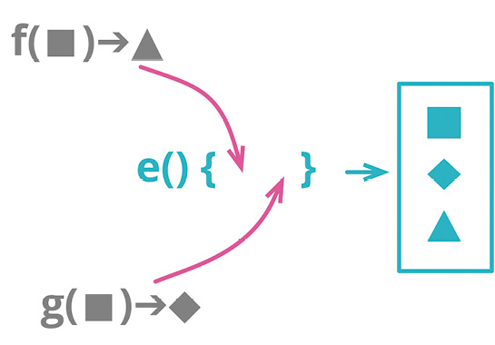
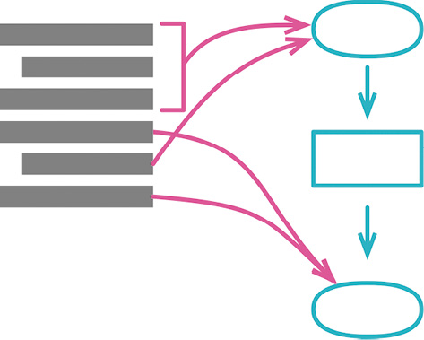

# 重构的方法论

## 重构的记录格式
介绍重构时，我采用一种标准格式。每个重构手法都有如下 5 个部分。
*  首先是名称（name）。要建造一个重构词汇表，名称是很重要的。这个名称也就是我将在本书其他地方使用的名称。如今重构经常会有多个名字，所以我会同时列出常见的别名。
* 名称之后是一个简单的速写（sketch）。这部分可以帮助你更快找到你所需要的重构手法
* 动机（motivation）为你介绍“为什么需要做这个重构”和“什么情况下不该做这个重构”
* 做法（mechanics）简明扼要地一步一步介绍如何进行此重构
* 范例（examples）以一个十分简单的例子说明此重构手法如何运作

## 重构的做法
### 提炼函数（Extract Function）
反向重构：内联函数

动机：将意图与实现分开”：如果你需要花时间浏览一段代码才能弄清它到底在干什么，那么就应该将其提炼到一个函数中，并根据它所做的事为其命名。以后再读到这段代码时，你一眼就能看到函数的用途，大多数时候根本不需要关心函数如何达成其用途（这是函数体内干的事）

做法：
* 创造一个新函数，根据这个函数的意图来对它命名
* 将待提炼的代码从源函数复制到新建的目标函数中
* 仔细检查提炼出的代码，看看其中是否引用了作用域限于源函数、在提炼出的新函数中访问不到的变量。若是，以参数的形式将它们传递给新函数
* 所有变量都处理完之后，编译
* 在源函数中，将被提炼代码段替换为对目标函数的调用
* 测试
* 查看其他代码是否有与被提炼的代码段相同或相似之处。如果有，考虑使用以函数调用取代内联代码令其调用提炼出的新函数

### 内联函数（Inline Function）
动机：
* 某些函数，其内部代码和函数名称同样清晰易读。也可能你重构了该函数的内部实现，使其内容和其名称变得同样清晰
* 我手上有一群组织不甚合理的函数。可以将它们都内联到一个大型函数中，再以我喜欢的方式重新提炼出小函数
* 代码中有太多间接层，使得系统中的所有函数都似乎只是对另一个函数的简单委托

做法：
* 检查函数，确定它不具多态性。
* 找出这个函数的所有调用点。
* 将这个函数的所有调用点都替换为函数本体。
* 每次替换之后，执行测试。
* 删除该函数的定义。

### 提炼变量（Extract Variable）
动机：表达式有可能非常复杂而难以阅读

做法：
* 确认要提炼的表达式没有副作用。
* 声明一个不可修改的变量，把你想要提炼的表达式复制一份，以该表达式的结果值给这个变量赋值。
* 用这个新变量取代原来的表达式。
* 测试

### 内联变量（Inline Variable）
动机：变量名字并不比表达式本身更具表现力。还有些时候，变量可能会妨碍重构附近的代码

做法：
* 检查确认变量赋值语句的右侧表达式没有副作用
* 如果变量没有被声明为不可修改，先将其变为不可修改，并执行测试
* 找到第一处使用该变量的地方，将其替换为直接使用赋值语句的右侧表达式
* 测试
* 重复前面两步，逐一替换其他所有使用该变量的地方
* 删除该变量的声明点和赋值语句
* 测试

### 改变函数声明（Change Function Declaration）
动机：
* 一个好名字能让我一眼看出函数的用途，
* 修改参数列表不仅能增加函数的应用范围，还能改变连接一个模块所需的条件，从而去除不必要的耦合

做法：
* 如果有必要的话，先对函数体内部加以重构，使后面的提炼步骤易于开展
* 使用提炼函数（106）将函数体提炼成一个新函数
* 如果提炼出的函数需要新增参数，用前面的简单做法添加即可。
* 测试。
* 对旧函数使用内联函数（115）。
* 如果新函数使用了临时的名字，再次使用改变函数声明（124）将其改回原来的名字。
* 测试
* 如果要重构的函数属于一个具有多态性的类，那么对于该函数的每个实现版本，你都需要通过“提炼出一个新函数”的方式添加一层间接，并把旧函数的调用转发给新函数。
* 如果要重构一个已对外发布的 API，在提炼出新函数之后，你可以暂停重构，将原来的函数声明为“不推荐使用”（deprecated），然后给客户端一点时间转为使用新函数。等你有信心所有客户端都已经从旧函数迁移到新函数，再移除旧函数的声明

### 封装变量（Encapsulate Variable）
动机：封装能提供一个清晰的观测点，可以由此监控数据的变化和使用情况；还可以轻松地添加数据被修改时的验证或后续逻辑

做法：
* 创建封装函数，在其中访问和更新变量值
* 执行静态检查
* 逐一修改使用该变量的代码，将其改为调用合适的封装函数。每次替换之后，执行测试
* 限制变量的可见性
* 测试
* 如果变量的值是一个记录，考虑使用封装记录（162）

### 变量改名（Rename Variable）

动机： 变量可以很好地解释一段程序在干什么——如果变量名起得好的话

做法：
* 如果变量被广泛使用，考虑运用封装变量（132）将其封装起来
* 找出所有使用该变量的代码，逐一修改
* 如果变量值从不修改，可以将其复制到一个新名字之下，然后逐一修改使用代码，每次修改后执行测试
* 测试

### 引入参数对象（Introduce Parameter Object）

动机： 将数据组织成结构是一件有价值的事，因为这让数据项之间的关系变得明晰。使用新的数据结构，参数的参数列表也能缩短。并且经过重构之后，所有使用该数据结构的函数都会通过同样的名字来访问其中的元素，从而提升代码的一致性。

做法：
* 如果暂时还没有一个合适的数据结构，就创建一个
* 测试
* 使用改变函数声明（124）给原来的函数新增一个参数，类型是新建的数据结构
* 测试
* 调整所有调用者，传入新数据结构的适当实例。每修改一处，执行测试
* 用新数据结构中的每项元素，逐一取代参数列表中与之对应的参数项，然后删除原来的参数
* 测试

### 函数组合成类（Combine Functions into Class）

动机: 如果发现一组函数形影不离地操作同一块数据（通常是将这块数据作为参数传递给函数），我就认为，是时候组建一个类了。类能明确地给这些函数提供一个共用的环境，在对象内部调用这些函数可以少传许多参数，从而简化函数调用，并且这样一个对象也可以更方便地传递给系统的其他部分

做法：
* 运用封装记录（162）对多个函数共用的数据记录加以封装
* 对于使用该记录结构的每个函数，运用搬移函数（198）将其移入新类
* 用以处理该数据记录的逻辑可以用提炼函数（106）提炼出来，并移入新类

### 函数组合成变换（Combine Functions into Transform）

动机：派生数值可能会在几个不同地方用到，因此这些计算逻辑也常会在用到派生数据的地方重复

做法
* 创建一个变换函数，输入参数是需要变换的记录，并直接返回该记录的值
* 挑选一块逻辑，将其主体移入变换函数中，把结果作为字段添加到输出记录中。修改客户端代码，令其使用这个新字段
* 测试
* 针对其他相关的计算逻辑，重复上述步骤

### 拆分阶段（Split Phase）

动机：一段代码在同时处理不同的事

做法：
* 将第二阶段的代码提炼成独立的函数
* 测试
* 引入一个中转数据结构，将其作为参数添加到提炼出的新函数的参数列表中
* 测试
* 逐一检查提炼出的“第二阶段函数”的每个参数。如果某个参数被第一阶段用到，就将其移入中转数据结构。每次搬移之后都要执行测试
* 对第一阶段的代码运用提炼函数（106），让提炼出的函数返回中转数据结构

### 封装记录（Encapsulate Record）
动机：记录型结构是多数编程语言提供的一种常见特性。它们能直观地组织起存在关联的数据，让我可以将数据作为有意义的单元传递，而不仅是一堆数据的拼凑。

做法：
* 对持有记录的变量使用封装变量（132），将其封装到一个函数中
* 记得为这个函数取一个容易搜索的名字
* 创建一个类，将记录包装起来，并将记录变量的值替换为该类的一个实例。然后在类上定义一个访问函数，用于返回原始的记录。修改封装变量的函数，令其使用这个访问函数
* 测试
* 新建一个函数，让它返回该类的对象，而非那条原始的记录
* 对于该记录的每处使用点，将原先返回记录的函数调用替换为那个返回实例对象的函数调用。使用对象上的访问函数来获取数据的字段，如果该字段的访问函数还不存在，那就创建一个。每次更改之后运行测试
* 如果该记录比较复杂，例如是个嵌套解构，那么先重点关注客户端对数据的更新操作，对于读取操作可以考虑返回一个数据副本或只读的数据代理
* 移除类对原始记录的访问函数，那个容易搜索的返回原始数据的函数也要一并删除
* 测试
* 如果记录中的字段本身也是复杂结构，考虑对其再次应用封装记录（162）或封装集合（170）手法

### 封装集合（Encapsulate Collection）
动机： 封装程序中的所有可变数据。这使我很容易看清楚数据被修改的地点和修改方式，这样当我需要更改数据结构时就非常方便

做法：
* 如果集合的引用尚未被封装起来，先用封装变量（132）封装它
* 在类上添加用于“添加集合元素”和“移除集合元素”的函数
* 如果存在对该集合的设值函数，尽可能先用移除设值函数（331）移除它。如果不能移除该设值函数，至少让它返回集合的一份副本
* 执行静态检查
* 查找集合的引用点。如果有调用者直接修改集合，令该处调用使用新的添加/移除元素的函数。每次修改后执行测试
* 修改集合的取值函数，使其返回一份只读的数据，可以使用只读代理或数据副本
* 测试

###  以对象取代基本类型（Replace Primitive with Object）
动机：某个数据的操作不仅仅局限于打印时，我就会为它创建一个新类。一开始这个类也许只是简单包装一下简单类型的数据，不过只要类有了，日后添加的业务逻辑就有地可去了

做法：
* 如果变量尚未被封装起来，先使用封装变量（132）封装它。
* 为这个数据值创建一个简单的类。类的构造函数应该保存这个数据值，并为它提供一个取值函数。
* 执行静态检查。
* 修改第一步得到的设值函数，令其创建一个新类的对象并将其存入字段，如果有必要的话，同时修改字段的类型声明。
* 修改取值函数，令其调用新类的取值函数，并返回结果。
* 测试。
* 考虑对第一步得到的访问函数使用函数改名（124），以便更好反映其用途。
* 考虑应用将引用对象改为值对象（252）或将值对象改为引用对象（256），明确指出新对象的角色是值对象还是引用对象。

### 以查询取代临时变量（Replace Temp with Query）
动机：
* 变量抽取到函数里能使函数的分解过程更简单，不再需要将变量作为参数传递给提炼出来的小函数
* 改用函数还让我避免了在多个函数中重复编写计算逻辑。每当我在不同的地方看见同一段变量的计算逻辑，我就会想方设法将它们挪到同一个函数里

做法：
* 检查变量在使用前是否已经完全计算完毕，检查计算它的那段代码是否每次都能得到一样的值
* 如果变量目前不是只读的，但是可以改造成只读变量，那就先改造它
* 测试
* 将为变量赋值的代码段提炼成函数
* 如果变量和函数不能使用同样的名字，那么先为函数取个临时的名字
* 确保待提炼函数没有副作用。若有，先应用将查询函数和修改函数分离（306）手法隔离副作用
* 测试
* 应用内联变量（123）手法移除临时变量

### 提炼类（Extract Class）
动机： 一个类应该是一个清晰的抽象，只处理一些明确的责任

做法：
* 决定如何分解类所负的责
* 创建一个新的类，用以表现从旧类中分离出来的责任
* 如果旧类剩下的责任与旧类的名称不符，为旧类改名
* 构造旧类时创建一个新类的实例，建立“从旧类访问新类”的连接关系
* 对于你想搬移的每一个字段，运用搬移字段（207）搬移之。每次更改后运行测试
* 使用搬移函数（198）将必要函数搬移到新类。先搬移较低层函数（也就是“被其他函数调用”多于“调用其他函数”者）。每次更改后运行测试
* 检查两个类的接口，去掉不再需要的函数，必要时为函数重新取一个适合新环境的名字
* 决定是否公开新的类。如果确实需要，考虑对新类应用将引用对象改为值对象（252）使其成为一个值对象

### 内联类（Inline Class）
动机： 如果一个类不再承担足够责任，不再有单独存在的理由（这通常是因为此前的重构动作移走了这个类的责任），我就会挑选这一“萎缩类”的最频繁用户（也是一个类），以本手法将“萎缩类”塞进另一个类中

做法：
* 对于待内联类（源类）中的所有 public 函数，在目标类上创建一个对应的函数，新创建的所有函数应该直接委托至源类。
* 修改源类 public 方法的所有引用点，令它们调用目标类对应的委托方法。每次更改后运行测试。
* 将源类中的函数与数据全部搬移到目标类，每次修改之后进行测试，直到源类变成空壳为止。
* 删除源类，为它举行一个简单的“丧礼”

### 隐藏委托关系（Hide Delegate）
动机：受托类修改了接口，变化会波及通过服务对象使用它的所有客户端。我可以在服务对象上放置一个简单的委托函数，将委托关系隐藏起来，从而去除这种依赖

做法：
* 对于每个委托关系中的函数，在服务对象端建立一个简单的委托函数
* 调整客户端，令它只调用服务对象提供的函数。每次调整后运行测试
* 如果将来不再有任何客户端需要取用 Delegate（受托类），便可移除服务对象中的相关访问函数
* 测试

### 移除中间人（Remove Middle Man）
动机：当客户端要使用受托类的新特性时，你就必须在服务端添加一个简单委托函数。随着受托类的特性（功能）越来越多，更多的转发函数就会使人烦躁。服务类完全变成了一个中间人，此时就应该让客户直接调用受托类

做法：
* 为受托对象创建一个取值函数
* 对于每个委托函数，让其客户端转为连续的访问函数调用。每次替换后运行测试
* 替换完委托方法的所有调用点后，你就可以删掉这个委托方法了
* 这能通过可自动化的重构手法来完成，你可以先对受托字段使用封装变量（132），再应用内联函数（115）内联所有使用它的函数

### 替换算法（Substitute Algorithm）
动机： 用比较清晰的方式取代复杂的算法

做法：
* 整理一下待替换的算法，保证它已经被抽取到一个独立的函数中
* 先只为这个函数准备测试，以便固定它的行为
* 准备好另一个（替换用）算法
* 执行静态检查
* 运行测试，比对新旧算法的运行结果。如果测试通过，那就大功告成；否则，在后续测试和调试过程中，以旧算法为比较参照标准

### 搬移函数（Move Function）
动机：
* 它频繁引用其他上下文中的元素，而对自身上下文中的元素却关心甚少。此时，让它去与那些更亲密的元素相会，通常能取得更好的封装效果，因为系统别处就可以减少对当前模块的依赖
* 发现需要频繁调用一个别处的函数，我也会考虑搬移这个函数。有时你在函数内部定义了一个帮助函数，而该帮助函数可能在别的地方也有用处，此时就可以将它搬移到某些更通用的地方

做法：
* 检查函数在当前上下文里引用的所有程序元素（包括变量和函数），考虑是否需要将它们一并搬移
* 如果发现有些被调用的函数也需要搬移，我通常会先搬移它们。这样可以保证移动一组函数时，总是从依赖最少的那个函数入手。
* 如果该函数拥有一些子函数，并且它是这些子函数的唯一调用者，那么你可以先将子函数内联进来，一并搬移到新家后再重新提炼出子函数。
* 检查待搬移函数是否具备多态性。
* 在面向对象的语言里，还需要考虑该函数是否覆写了超类的函数，或者为子类所覆写。
* 将函数复制一份到目标上下文中。调整函数，使它能适应新家。
* 如果函数里用到了源上下文（source context）中的元素，我就得将这些元素一并传递过去，要么通过函数参数，要么是将当前上下文的引用传递到新的上下文那边去。
* 搬移函数通常意味着，我还得给它起个新名字，使它更符合新的上下文。
* 执行静态检查。
* 设法从源上下文中正确引用目标函数。
* 修改源函数，使之成为一个纯委托函数。
* 测试。
* 考虑对源函数使用内联函数（115）
* 也可以不做内联，让源函数一直做委托调用。但如果调用方直接调用目标函数也不费太多周折，那么最好还是把中间人移除掉。

### 搬移字段（Move Field）
动机：一个糟糕的数据结构则将招致许多无用代码，这些代码更多是在差劲的数据结构中间纠缠不清，而非为系统实现有用的行为

做法：
* 确保源字段已经得到了良好封装
* 测试
* 在目标对象上创建一个字段（及对应的访问函数）
* 执行静态检查
* 确保源对象里能够正常引用目标对象
* 也许你已经有现成的字段或方法得到目标对象。如果没有，看看是否能简单地创建一个方法完成此事。如果还是不行，你可能就得在源对象里创建一个字段，用于存储目标对象了。这次修改可能留存很久，但你也可以只做临时修改，等到系统其他部分的重构完成就回来移除它
* 调整源对象的访问函数，令其使用目标对象的字段
* 如果源类的所有实例对象都共享对目标对象的访问权，那么可以考虑先更新源类的设值函数，让它修改源字段时，对目标对象上的字段做同样的修* 改。然后，再通过引入断言（302），当检测到源字段与目标字段不一致时抛出错误。一旦你确定改动没有引入任何可观察的行为变化，就可以放心地让访问函数直接使用目标对象的字段了
* 测试
* 移除源对象上的字段
* 测试

### 搬移语句到函数（Move Statements into Function）
动机： 
* 如果我发现调用某个函数时，总有一些相同的代码也需要每次执行，那么我会考虑将此段代码合并到函数里头
* 如果它们与函数不像一个整体，但仍应与函数一起执行，那我可以用提炼函数（106）将语句和函数一并提炼出去

做法：
* 如果重复的代码段离调用目标函数的地方还有些距离，则先用移动语句（223）将这些语句挪动到紧邻目标函数的位置
* 如果目标函数仅被唯一一个源函数调用，那么只需将源函数中的重复代码段剪切并粘贴到目标函数中即可，然后运行测试。本做法的后续步骤至此可以忽略
* 如果函数不止一个调用点，那么先选择其中一个调用点应用提炼函数（106），将待搬移的语句与目标函数一起提炼成一个新函数。给新函数取个临时的名字，只要易于搜索即可
* 调整函数的其他调用点，令它们调用新提炼的函数。每次调整之后运行测试
* 完成所有引用点的替换后，应用内联函数（115）将目标函数内联到新函数里，并移除原目标函数
* 对新函数应用函数改名（124），将其改名为原目标函数的名字
* 如果你能想到更好的名字，那就用更好的那个

### 搬移语句到调用者（Move Statements to Callers）
动机：函数边界发生偏移————以往在多个地方共用的行为，如今需要在某些调用点面前表现出不同的行为

做法：
* 最简单的情况下，原函数非常简单，其调用者也只有寥寥一两个，此时只需把要搬移的代码从函数里剪切出来并粘贴回调用端去即可，必要的时候做些调整。运行测试。如果测试通过，那就大功告成，本手法可以到此为止
* 若调用点不止一两个，则需要先用提炼函数（106）将你不想搬移的代码提炼成一个新函数，函数名可以临时起一个，只要后续容易搜索即可
* 如果原函数是一个超类方法，并且有子类进行了覆写，那么还需要对所有子类的覆写方法进行同样的提炼操作，保证继承体系上每个类都有一份与超类相同的提炼函数。接着将子类的提炼函数删除，让它们引用超类提炼出来的函数
* 对原函数应用内联函数（115）
* 对提炼出来的函数应用改变函数声明（124），令其与原函数使用同一个名字
* 如果你能想到更好的名字，那就用更好的那个

### 以函数调用取代内联代码（Replace Inline Code with Function Call）
动机： 一些内联代码，它们做的事情仅仅是已有函数的重复，我通常会以一个函数调用取代内联代码

做法：
* 将内联代码替代为对一个既有函数的调用
* 测试

###  移动语句（Slide Statements）
动机： 让存在关联的东西一起出现，可以使代码更容易理解

做法：
* 确定待移动的代码片段应该被搬往何处。仔细检查待移动片段与目的地之间的语句，看看搬移后是否会影响这些代码正常工作。如果会，则放弃这项重构
* 往前移动代码片段时，如果片段中声明了变量，则不允许移动到任何变量的声明语句之前。往后移动代码片段时，如果有语句引用了待移动片段中的变量，则不允许移动到该语句之后。往后移动代码片段时，如果有语句修改了待移动片段中引用的变量，则不允许移动到该语句之后。往后移动代码片段时，如果片段中修改了某些元素，则不允许移动到任何引用了这些元素的语句之后
* 剪切源代码片段，粘贴到上一步选定的位置上
* 测试
* 如果测试失败，那么尝试减小移动的步子：要么是减少上下移动的行数，要么是一次搬移更少的代码

### 拆分循环（Split Loop）
动机： 拆分循环还能让每个循环更容易使用。如果一个循环只计算一个值，那么它直接返回该值即可；但如果循环做了太多件事，那就只得返回结构型数据或者通过局部变量传值了。

做法：
* 复制一遍循环代码
* 识别并移除循环中的重复代码，使每个循环只做一件事
* 测试
* 完成循环拆分后，考虑对得到的每个循环应用提炼函数（106）

### 以管道取代循环（Replace Loop with Pipeline）
动机： 一些逻辑如果采用集合管道来编写，代码的可读性会更强——我只消从头到尾阅读一遍代码，就能弄清对象在管道中间的变换过程

做法：
* 创建一个新变量，用以存放参与循环过程的集合。
* 也可以简单地复制一个现有的变量赋值给新变量。
* 从循环顶部开始，将循环里的每一块行为依次搬移出来，在上一步创建的集合变量上用一种管道运算替代之。每次修改后运行测试。
* 搬移完循环里的全部行为后，将循环整个删除。
* 如果循环内部通过累加变量来保存结果，那么移除循环后，将管道运算的最终结果赋值给该累加变量。

最佳实践: LINQ

### 移除死代码（Remove Dead Code）
动机： 一旦代码不再被使用，我们就该立马删除它。有可能以后又会需要这段代码，但我从不担心这种情况；就算真的发生，我也可以从版本控制系统里再次将它翻找出来。如果我真的觉得日后它极有可能再度启用，那还是要删掉它，只不过可以在代码里留一段注释，提一下这段代码的存在，以及它被移除的那个提交版本号

做法：
* 如果死代码可以从外部直接引用，比如它是一个独立的函数时，先查找一下还有无调用点
* 将死代码移除
* 测试

### 拆分变量（Split Variable）
动机：变量有各种不同的用途，其中某些用途会很自然地导致临时变量被多次赋值

做法：
* 在待分解变量的声明及其第一次被赋值处，修改其名称
* 如果稍后的赋值语句是“i=i+某表达式形式”，意味着这是一个结果收集变量，就不要分解它。结果收集变量常用于累加、字符串拼接、写入流或者向集合添加元素
* 如果可能的话，将新的变量声明为不可修改
* 以该变量的第二次赋值动作为界，修改此前对该变量的所有引用，让它们引用新变量
* 测试
* 重复上述过程。每次都在声明处对变量改名，并修改下次赋值之前的引用，直至到达最后一处赋值

###  字段改名（Rename Field）
动机：字段的命名格外重要，数据结构对于帮助阅读者理解特别重要

做法：
* 如果字段的作用域较小，可以直接修改所有该字段的代码，然后测试。后面的步骤就都不需要了。
* 如果字段还未封装，请先使用字段记录（162）。
* 在对象内部对私有字段改名，对应调整内部访问该字段的函数。
* 测试。
* 如果构造函数的参数用了旧的字段名，运用改变函数声明（124）将其改名。
* 运用函数改名（124）给访问函数改名。

### 以查询取代派生变量（Replace Derived Variable with Query）
动机： 有些变量其实可以很容易地随时计算出来。如果能去掉这些变量，也算朝着消除可变性的方向迈出了一大步。计算常能更清晰地表达数据的含义，而且也避免了“源数据修改时忘了更新派生变量”的错误。

做法：
* 识别出所有对变量做更新的地方。如有必要，用拆分变量（240）分割各个更新点
* 新建一个函数，用于计算该变量的值
* 用引入断言（302）断言该变量和计算函数始终给出同样的值
* 如有必要，用封装变量（132）将这个断言封装起来
* 测试
* 修改读取该变量的代码，令其调用新建的函数
* 测试
* 用移除死代码（237）去掉变量的声明和赋值

### 将引用对象改为值对象（Change Reference to Value）
动机： 仅仅需要不可变的对象，不可变的数据值传给程序的其他部分，而不必担心对象中包装的数据被偷偷修改可以在程序各处复制值对象，而不必操心维护内存链接。

做法：
* 检查重构目标是否为不可变对象，或者是否可修改为不可变对象
* 用移除设值函数（331）逐一去掉所有设值函数
* 提供一个基于值的相等性判断函数，在其中使用值对象的字段
* 大多数编程语言都提供了可覆写的相等性判断函数。通常你还必须同时覆写生成散列码的函数

### 将值对象改为引用对象（Change Value to Reference）
动机： 一个数据结构中可能包含多个记录，而这些记录都关联到同一个逻辑数据结构且共享的数据需要更新。

做法：
* 为相关对象创建一个仓库（如果还没有这样一个仓库的话）
* 确保构造函数有办法找到关联对象的正确实例
* 修改宿主对象的构造函数，令其从仓库中获取关联对象。每次修改后执行测试

### 分解条件表达式（Decompose Conditional）
动机： 在带有复杂条件逻辑的函数中，代码（包括检查条件分支的代码和真正实现功能的代码）会告诉我发生的事，但常常让我弄不清楚为什么会发生这样的事，这就说明代码的可读性的确大大降低了。

做法：
* 对条件判断和每个条件分支分别运用提炼函数（106）手法

### 合并条件表达式（Consolidate Conditional Expression）
动机： 检查条件各不相同，最终行为却一致。如果发现这种情况，就应该使用“逻辑或”和“逻辑与”将它们合并为一个条件表达式

做法：
* 确定这些条件表达式都没有副作用
* 如果某个条件表达式有副作用，可以先用将查询函数和修改函数分离（306）处理
* 使用适当的逻辑运算符，将两个相关条件表达式合并为一个
* 顺序执行的条件表达式用逻辑或来合并，嵌套的 if 语句用逻辑与来合并
* 测试
* 重复前面的合并过程，直到所有相关的条件表达式都合并到一起
* 可以考虑对合并后的条件表达式实施提炼函数（106）

### 以卫语句取代嵌套条件表达式（Replace Nested Conditional with Guard Clauses）
动机： 嵌套条件表达式过于复杂

做法：
* 选中最外层需要被替换的条件逻辑，将其替换为卫语句
* 测试
* 有需要的话，重复上述步骤
* 如果所有卫语句都引发同样的结果，可以使用合并条件表达式（263）合并之

### 以多态取代条件表达式（Replace Conditional with Polymorphism）
动机：
* 构造一组类型，每个类型处理各自的一种条件逻辑
* 有一个基础逻辑，在其上又有一些变体。基础逻辑可能是最常用的，也可能是最简单的。我可以把基础逻辑放进超类，这样我可以首先理解这部分逻辑，暂时不管各种变体，然后我可以把每种变体逻辑单独放进一个子类，其中的代码着重强调与基础逻辑的差异

做法：
做法
* 如果现有的类尚不具备多态行为，就用工厂函数创建之，令工厂函数返回恰当的对象实例
* 在调用方代码中使用工厂函数获得对象实例
* 将带有条件逻辑的函数移到超类中
* 如果条件逻辑还未提炼至独立的函数，首先对其使用提炼函数（106）
* 任选一个子类，在其中建立一个函数，使之覆写超类中容纳条件表达式的那个函数。将与该子类相关的条件表达式分支复制到新函数中，并对它进行适当调整
* 重复上述过程，处理其他条件分支
* 在超类函数中保留默认情况的逻辑。或者，如果超类应该是抽象的，就把该函数声明为 abstract，或在其中直接抛出异常，表明计算责任都在子类中

### 引入特例（Introduce Special Case）
动机：一个数据结构的使用者都在检查某个特殊的值，并且当这个特殊值出现时所做的处理也都相同。如果我发现代码库中有多处以同样方式应对同一个特殊值，我就会想要把这个处理逻辑收拢到一处

做法：
* 我们从一个作为容器的数据结构（或者类）开始，其中包含一个属性，该属性就是我们要重构的目标。容器的客户端每次使用这个属性时，都需要将其与某个特例值做比对。我们希望把这个特例值替换为代表这种特例情况的类或数据结构
* 给重构目标添加检查特例的属性，令其返回 false
* 创建一个特例对象，其中只有检查特例的属性，返回 true
* 对“与特例值做比对”的代码运用提炼函数（106），确保所有客户端都使用这个新函数，而不再直接做特例值的比对
* 将新的特例对象引入代码中，可以从函数调用中返回，也可以在变换函数中生成
* 修改特例比对函数的主体，在其中直接使用检查特例的属性
* 测试
* 使用函数组合成类（144）或函数组合成变换（149），把通用的特例处理逻辑都搬移到新建的特例对象中
* 特例类对于简单的请求通常会返回固定的值，因此可以将其实现为字面记录（literal record）
* 对特例比对函数使用内联函数（115），将其内联到仍然需要的地方

### 引入断言（Introduce Assertion）
动机：只有当某个条件为真时，该段代码才能正常运行

做法：
* 如果你发现代码假设某个条件始终为真，就加入一个断言明确说明这种情况
* 因为断言应该不会对系统运行造成任何影响，所以“加入断言”永远都应该是行为保持的

### 将查询函数和修改函数分离（Separate Query from Modifier）
动机：任何有返回值的函数，都不应该有看得到的副作用——命令与查询分离（Command-Query Separation）

做法：
* 复制整个函数，将其作为一个查询来命名。
* 如果想不出好名字，可以看看函数返回的是什么。查询的结果会被填入一个变量，这个变量的名字应该能对函数如何命名有所启发。
* 从新建的查询函数中去掉所有造成副作用的语句。
* 执行静态检查。
* 查找所有调用原函数的地方。如果调用处用到了该函数的返回值，就将其改为调用新建的查询函数，并在下面马上再调用一次原函数。每次修改之后都要测试。
* 从原函数中去掉返回值。
* 测试。
* 完成重构之后，查询函数与原函数之间常会有重复代码，可以做必要的清理。

###  函数参数化（Parameterize Function）
动机： 如果我发现两个函数逻辑非常相似，只有一些字面量值不同，可以将其合并成一个函数，以参数的形式传入不同的值，从而消除重复

做法：
* 从一组相似的函数中选择一个
* 运用改变函数声明（124），把需要作为参数传入的字面量添加到参数列表中
* 修改该函数所有的调用处，使其在调用时传入该字面量值
* 测试
* 修改函数体，令其使用新传入的参数。每使用一个新参数都要测试
* 对于其他与之相似的函数，逐一将其调用处改为调用已经参数化的函数。每次修改后都要测试
* 如果第一个函数经过参数化以后不能直接替代另一个与之相似的函数，就先对参数化之后的函数做必要的调整，再做替换

### 移除标记参数（Remove Flag Argument）
动机： 移除标记参数不仅使代码更整洁，并且能帮助开发工具更好地发挥作用

做法：
* 针对参数的每一种可能值，新建一个明确函数。
* 如果主函数有清晰的条件分发逻辑，可以用分解条件表达式（260）创建明确函数；否则，可以在原函数之上创建包装函数。
* 对于“用字面量值作为参数”的函数调用者，将其改为调用新建的明确函数

### 保持对象完整（Preserve Whole Object）
动机： 如果我看见代码从一个记录结构中导出几个值，然后又把这几个值一起传递给一个函数，我会更愿意把整个记录传给这个函数，在函数体内部导出所需的值。

做法：
* 新建一个空函数，给它以期望中的参数列表（即传入完整对象作为参数）
* 给这个函数起一个容易搜索的名字，这样到重构结束时方便替换
* 在新函数体内调用旧函数，并把新的参数（即完整对象）映射到旧的参数列表（即来源于完整对象的各项数据）
* 执行静态检查
* 逐一修改旧函数的调用者，令其使用新函数，每次修改之后执行测试
* 修改之后，调用处用于“从完整对象中导出参数值”的代码可能就没用了，可以用移除死代码（237）去掉
* 所有调用处都修改过来之后，使用内联函数（115）把旧函数内联到新函数体内
* 给新函数改名，从重构开始时的容易搜索的临时名字，改为使用旧函数的名字，同时修改所有调用处

### 以查询取代参数（Replace Parameter with Query）
动机： 如果调用函数时传入了一个值，而这个值由函数自己来获得也是同样容易，这就是重复

不动的场景：
* 移除参数可能会给函数体增加不必要的依赖关系——迫使函数访问某个程序元素，而我原本不想让函数了解这个元素的存在
* 如果在处理的函数具有引用透明性（referential transparency，即，不论任何时候，只要传入相同的参数值，该函数的行为永远一致），这样的函数既容易理解又容易测试，我不想使其失去这种优秀品质。我不会去掉它的参数，让它去访问一个可变的全局变量

做法：
* 如果有必要，使用提炼函数（106）将参数的计算过程提炼到一个独立的函数中
* 将函数体内引用该参数的地方改为调用新建的函数。每次修改后执行测试
* 全部替换完成后，使用改变函数声明（124）将该参数去掉

### 以参数取代查询（Replace Query with Parameter）
动机： 引用一个全局变量，或者引用另一个我想要移除的元素。为了解决这些令人不快的引用，我需要将其替换为函数参数，从而将处理引用关系的责任转交给函数的调用者

做法：
* 对执行查询操作的代码使用提炼变量（119），将其从函数体中分离出来
* 现在函数体代码已经不再执行查询操作（而是使用前一步提炼出的变量），对这部分代码使用提炼函数（106）
* 给提炼出的新函数起一个容易搜索的名字，以便稍后改名
* 使用内联变量（123），消除刚才提炼出来的变量
* 对原来的函数使用内联函数（115）
* 对新函数改名，改回原来函数的名字

### 移除设值函数（Remove Setting Method）
动机： 如果不希望在对象创建之后此字段还有机会被改变，那就不要为它提供设值函数（同时将该字段声明为不可变）

做法：
* 如果构造函数尚无法得到想要设入字段的值，就使用改变函数声明（124）将这个值以参数的形式传入构造函数。在构造函数中调用设值函数，对字段设值
* 如果想移除多个设值函数，可以一次性把它们的值都传入构造函数，这能简化后续步骤
* 移除所有在构造函数之外对设值函数的调用，改为使用新的构造函数。每次修改之后都要测试
* 如果不能把“调用设值函数”替换为“创建一个新对象”（例如你需要更新一个多处共享引用的对象），请放弃本重构
* 使用内联函数（115）消去设值函数。如果可能的话，把字段声明为不可变
* 测试

### 以工厂函数取代构造函数（Replace Constructor with Factory Function）
动机： 构造函数的名字是固定的，因此无法使用比默认名字更清晰的函数名；构造函数需要通过特殊的操作符来调用（在很多语言中是 new 关键字），所以在要求普通函数的场合就难以使用。

做法：
* 新建一个工厂函数，让它调用现有的构造函数
* 将调用构造函数的代码改为调用工厂函数
* 每修改一处，就执行测试
* 尽量缩小构造函数的可见范围

###  以命令取代函数（Replace Function with Command）
动机： 与普通的函数相比，命令对象提供了更大的控制灵活性和更强的表达能力

做法：
* 为想要包装的函数创建一个空的类，根据该函数的名字为其命名
* 使用搬移函数（198）把函数移到空的类里
* 保持原来的函数作为转发函数，至少保留到重构结束之前才删除
* 遵循编程语言的命名规范来给命令对象起名。如果没有合适的命名规范，就给命令对象中负责实际执行命令的函数起一个通用的名字，例如“execute”或者“call”
* 可以考虑给每个参数创建一个字段，并在构造函数中添加对应的参数

### 以函数取代命令（Replace Command with Function）
动机： 函数不是太复杂，那么命令对象可能显得费而不惠，我就应该考虑将其变回普通的函数

做法：
* 运用提炼函数（106），把“创建并执行命令对象”的代码单独提炼到一个函数中
* 这一步会新建一个函数，最终这个函数会取代现在的命令对象
* 对命令对象在执行阶段用到的函数，逐一使用内联函数（115）
* 如果被调用的函数有返回值，请先对调用处使用提炼变量（119），然后再使用内联函数（115）
* 使用改变函数声明（124），把构造函数的参数转移到执行函数
* 对于所有的字段，在执行函数中找到引用它们的地方，并改为使用参数。每次修改后都要测试
* 把“调用构造函数”和“调用执行函数”两步都内联到调用方（也就是最终要替换命令对象的那个函数）
* 测试
* 用移除死代码（237）把命令类消去

### 函数上移（Pull Up Method）
动机： 如果某个函数在各个子类中的函数体都相同

做法：
* 检查待提升函数，确定它们是完全一致的
* 如果它们做了相同的事情，但函数体并不完全一致，那就先对它们进行重构，直到其函数体完全一致
* 检查函数体内引用的所有函数调用和字段都能从超类中调用到
* 如果待提升函数的签名不同，使用改变函数声明（124）将那些签名都修改为你想要在超类中使用的签名
* 在超类中新建一个函数，将某一个待提升函数的代码复制到其中
* 执行静态检查
* 移除一个待提升的子类函数
* 测试
* 逐一移除待提升的子类函数，直到只剩下超类中的函数为止

### 字段上移（Pull Up Field）
动机： 如果各子类是分别开发的，或者是在重构过程中组合起来的，你常会发现它们拥有重复特性，特别是字段更容易重复

做法：
* 针对待提升之字段，检查它们的所有使用点，确认它们以同样的方式被使用
* 如果这些字段的名称不同，先使用变量改名（137）为它们取个相同的名字
* 在超类中新建一个字段
* 新字段需要对所有子类可见（在大多数语言中 protected 权限便已足够）
* 移除子类中的字段
* 测试

###  构造函数本体上移（Pull Up Constructor Body）
动机： 构造函数中部分代码在各个子类中的函数体都相同

做法：
* 如果超类还不存在构造函数，首先为其定义一个。确保让子类调用超类的构造函数
* 使用移动语句（223）将子类中构造函数中的公共语句移动到超类的构造函数调用语句之后
* 逐一移除子类间的公共代码，将其提升至超类构造函数中。对于公共代码中引用到的变量，将其作为参数传递给超类的构造函数
* 测试
* 如果存在无法简单提升至超类的公共代码，先应用提炼函数（106），再利用函数上移（350）提升之

### 函数下移（Push Down Method）
动机：如果超类中的某个函数只与一个（或少数几个）子类有关，那么最好将其从超类中挪走，放到真正关心它的子类中去

做法：
* 将超类中的函数本体复制到每一个需要此函数的子类中
* 删除超类中的函数
* 测试
* 将该函数从所有不需要它的那些子类中删除
* 测试

### 字段下移（Push Down Field）
动机：如果某个字段只被一个子类（或者一小部分子类）用到，就将其搬移到需要该字段的子类中。

做法：
* 在所有需要该字段的子类中声明该字
* 将该字段从超类中移除
* 测试
* 将该字段从所有不需要它的那些子类中删掉
* 测试

### 以子类取代类型码（Replace Type Code with Subclasses）
动机： 如果有几个函数都在根据类型码的取值采取不同的行为或者有些字段或函数只对特定的类型码取值才有意义

做法：
* 自封装类型码字段
* 任选一个类型码取值，为其创建一个子类。覆写类型码类的取值函数，令其返回该类型码的字面量值
* 创建一个选择器逻辑，把类型码参数映射到新的子类
* 如果选择直接继承的方案，就用以工厂函数取代构造函数（334）包装构造函数，把选择器逻辑放在工厂函数里；如果选择间接继承的方案，选择器逻辑可以保留在构造函数里
* 测试
* 针对每个类型码取值，重复上述“创建子类、添加选择器逻辑”的过程。每次修改后执行测试
* 去除类型码字段
* 测试
* 使用函数下移（359）和以多态取代条件表达式（272）处理原本访问了类型码的函数。全部处理完后，就可以移除类型码的访问函数

### 移除子类（Remove Subclass）
动机： 随着软件的演化，子类所支持的变化可能会被搬移到别处，甚至完全去除，这时子类就失去了价值。有时添加子类是为了应对未来的功能，结果构想中的功能压根没被构造出来，或者用了另一种方式构造，使该子类不再被需要了

做法：
* 使用以工厂函数取代构造函数（334），把子类的构造函数包装到超类的工厂函数中
* 如果构造函数的客户端用一个数组字段来决定实例化哪个子类，可以把这个判断逻辑放到超类的工厂函数中
* 如果有任何代码检查子类的类型，先用提炼函数（106）把类型检查逻辑包装起来，然后用搬移函数（198）将其搬到超类。每次修改后执行测试
* 新建一个字段，用于代表子类的类型
* 将原本针对子类的类型做判断的函数改为使用新建的类型字段
* 删除子类
* 测试
* 本重构手法常用于一次移除多个子类，此时需要先把这些子类都封装起来（添加工厂函数、搬移类型检查），然后再逐个将它们折叠到超类中

### 提炼超类（Extract Superclass）
动机：如果我看见两个类在做相似的事，可以利用基本的继承机制把它们的相似之处提炼到超类

做法：
* 为原本的类新建一个空白的超类
* 如果需要的话，用改变函数声明（124）调整构造函数的签名
* 测试
* 使用构造函数本体上移（355）、函数上移（350）和字段上移（353）手法，逐一将子类的共同元素上移到超类
* 检查留在子类中的函数，看它们是否还有共同的成分。如果有，可以先用提炼函数（106）将其提炼出来，再用函数上移（350）搬到超类
* 检查所有使用原本的类的客户端代码，考虑将其调整为使用超类的接口

### 折叠继承体系（Collapse Hierarchy）
动机： 我有时会发现一个类与其超类已经没多大差别，不值得再作为独立的类存在

做法：
* 选择想移除的类：是超类还是子类
* 我选择的依据是看哪个类的名字放在未来更有意义。如果两个名字都不够好，我就随便挑一个
* 使用字段上移（353）、字段下移（361）、函数上移（350）和函数下移（359），把所有元素都移到同一个类中
* 调整即将被移除的那个类的所有引用点，令它们改而引用合并后留下的类
* 移除我们的目标；此时它应该已经成为一个空类
* 测试

###  以委托取代子类（Replace Subclass with Delegate）
动机： 继承只能用于处理一个方向上的变化

做法：
* 如果构造函数有多个调用者，首先用以工厂函数取代构造函数（334）把构造函数包装起来
* 创建一个空的委托类，这个类的构造函数应该接受所有子类特有的数据项，并且经常以参数的形式接受一个指回超类的引用
* 在超类中添加一个字段，用于安放委托对象
* 修改子类的创建逻辑，使其初始化上述委托字段，放入一个委托对象的实例
* 这一步可以在工厂函数中完成，也可以在构造函数中完成（如果构造函数有足够的信息以创建正确的委托对象的话）
* 选择一个子类中的函数，将其移入委托类
* 使用搬移函数（198）手法搬移上述函数，不要删除源类中的委托代码
* 如果这个方法用到的其他元素也应该被移入委托对象，就把它们一并搬移。如果它用到的元素应该留在超类中，就在委托对象中添加一个字段，令其指向超类的实例
* 如果被搬移的源函数还在子类之外被调用了，就把留在源类中的委托代码从子类移到超类，并在委托代码之前加上卫语句，检查委托对象存在。如果子类之外已经没有其他调用者，就用移除死代码（237）去掉已经没人使用的委托代码
* 如果有多个委托类，并且其中的代码出现了重复，就使用提炼超类（375）手法消除重复。此时如果默认行为已经被移入了委托类的超类，源超类的委托函数就不再需要卫语句了
* 测试
* 重复上述过程，直到子类中所有函数都搬到委托类
* 找到所有调用子类构造函数的地方，逐一将其改为使用超类的构造函数
* 测试
* 运用移除死代码（237）去掉子类

### 以委托取代超类（Replace Superclass with Delegate）
动机： 如果超类的一些函数对子类并不适用，就说明我不应该通过继承来获得超类的功能

做法：
* 在子类中新建一个字段，使其引用超类的一个对象，并将这个委托引用初始化为超类的新实例
* 针对超类的每个函数，在子类中创建一个转发函数，将调用请求转发给委托引用。每转发一块完整逻辑，都要执行测试
* 大多数时候，每转发一个函数就可以测试，但一对设值/取值必须同时转移，然后才能测试
* 当所有超类函数都被转发函数覆写后，就可以去掉继承关系